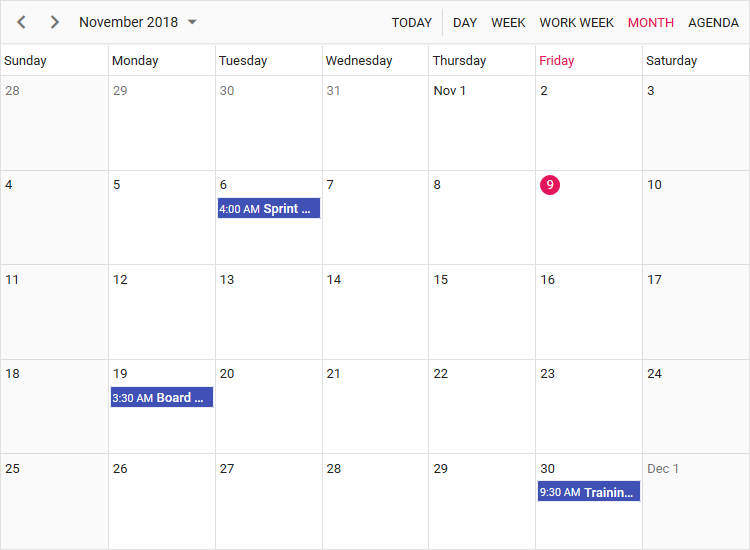

# Syncfusion Angular 4 Scheduler Quick Start Project

A quick start project that helps you to create the Syncfusion Angular 4 Scheduler with minimal code configuration.



## Scheduler features covered in this Project

This is an Angular 4 project created using [Angular CLI](https://github.com/angular/angular-cli) 1.410. The Scheduler features included in this project are as follows.
* Angular 4 Scheduler displaying basic views with appointments loaded as JSON data.
* Drag and resize actions enabled for events by default.
* Setting current date and view for scheduler.
* Setting specific timezone on scheduler.

## Project pre-requisites
Make sure that you have the compatible versions of TypeScript and Angular in your machine before starting to work on this project.
* Angular 4+
* TypeScript 2.6+

## How to run this application?
To run this application, you need to first clone the `Angular-4-Scheduler` repository and then navigate to its appropriate path where it has been located in your system.

To do so, open the command prompt and run the below commands one after the other.

```
git clone https://github.com/SyncfusionSamples/Angular-4-Scheduler angular-4-scheduler
cd angular-4-scheduler
```

## Installing
Once done with downloading, next you need to install the necessay packages required to run this application locally. The `npm install` command will install all the needed angular packages into your current project and to do so, run the below command.

```
npm install
```
## Running on development server
Run `ng serve` for a dev server. Navigate to `http://localhost:4200/`. The app will automatically reload if you change any of the source files.

## Further help

To get more help on the Angular CLI use `ng help` or go check out the [Angular CLI README](https://github.com/angular/angular-cli/blob/master/README.md).
